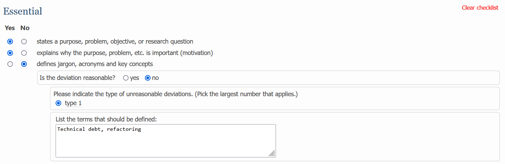

<section id="intro_section">
	

		<h1>
			ACM SIGSOFT
			Empirical Standards for Software Engineering
		</h1>
	   	
		

			
The ACM SIGSOFT Empirical Standards are the official evidence standards (models of a community's expectations for conducting and reporting studies) for software engineering research.

		

		
		<a class="page_link" href="https://www2.sigsoft.org/EmpiricalStandards/tools/">Review a paper</a>
	

    

		
	

</section>

<section id="feature_section">
	

		
		<h3>19 empirical standards to choose from</h3>
		
Different kinds of research have different norms, so each common research method has a unique standard

	

	
	

		
		<h3>Checklists for authors and reviewers</h3>
		
Use standards-based checklists to improve your methods, papers, and peer reviews

	

	
	

		
		<h3>Desirable and extraordinary attributes</h3>
		
Standards and checklists clearly differentiate must-haves from exceptional research

	

</section>

<section id="instruction_section">
	<h2>Features of the standards</h2>
	
	

		

			<h3>Specific attributes</h3>
			
A list of properties the paper should possess, grouped into essential, desirable, and extraordinary

		

		

			
<q cite="https://www2.sigsoft.org/EmpiricalStandards/docs/standards?standard=EngineeringResearch#">Conceptually evaluates the proposed artifact; discusses its strengths, weaknesses and limitations.</q>  Engineering Research

		

	

	
	

		

			<h3>General quality criteria</h3>
			
Qualitative and quantitative quality criteria the paper should meet

		

		

			
<q cite="https://www2.sigsoft.org/EmpiricalStandards/docs/standards?standard=Experiments#">Conclusion validity, construct validity, internal validity, reliability, objectivity, reproducibility.</q>  Experiment

		

	

	
	

		

			<h3>Acceptable deviations</h3>
			
Circumstances where the paper is permitted to deviate from a standard

		

		

			
<q cite="https://www2.sigsoft.org/EmpiricalStandards/docs/standards?standard=DataScience#">Data not shared because it is impractical (e.g. too large) or unethical (e.g. too sensitive)</q>  Data Science

		

	

	
	

		

			<h3>Antipatterns</h3>
			
Common problems with this methodology that papers should avoid

		

		

			
<q cite="https://www2.sigsoft.org/EmpiricalStandards/docs/standards?standard=GroundedTheory#">Data analysis focusing on counting words, codes, concepts, or categories instead of interpreting.</q>  Grounded Theory

		

	

	
	

		

			<h3>Invalid criticisms</h3>
			
Unreasonable arguments against a paper that reviewers should not make

		

		

			
<q cite="https://www2.sigsoft.org/EmpiricalStandards/docs/standards?standard=Replication#">The replication merely confirms the findings of the original study; no inconsistencies are reported.</q>  Replication

		

	

	
	

		

			<h3>Suggested readings</h3>
			
Additional scholarship on the method upon which the standard is based

		

		

			
<q cite="https://www2.sigsoft.org/EmpiricalStandards/docs/standards?standard=SystematicReviews#">Barbara Kitchenham and Stuart Charters. 2007. Guidelines for performing Systematic Literature Reviews in Software Engineering.</q>  Systematic Review

		

	

	
	

		

			<h3>Exemplars</h3>
			
Good examples of the method that authors should emulate

		

		

			
<q cite="https://www2.sigsoft.org/EmpiricalStandards/docs/standards?standard=CaseStudy">Diomidis Spinellis and Paris C. Avgeriou. Evolution of the Unix System Architecture: An Exploratory Case Study. IEEE Transactions on Software Engineering. (2019).</q>  Case Study

		

	

	
	
	
		

			
Interactive checklists

			
Interactive checklists based on the standards make peer review more specific, technical, and reliable.
			Customized diagnostics help reviewers make more reasonable and actionable suggestions.

			
			<ul class="benefit_list">
				<li>More effective, transparent peer reviews</li>
				<li>Faster publication times</li>
				<li>Reduced reviewer workload</li>
				<li>Higher-quality papers</li>
			</ul>
		

		
	

	
</section>

<section id="history_section">
	<h2>History</h2>
	
	

		

			
MAY 2019

			
At ICSE town hall, SIGSOFT launches the "Improving Paper and Peer Review Quality Initiative"

		

		
		

			
MAY 2020

			
First 8 empirical standards drafted

		

		
		

			
OCT 2020

			

				Empirical Standards Report made accessible on arXiv <!-- Link to report -->
				<a href="https://arxiv.org/abs/2010.03525">Read the Empirical Standards Report →</a>
			

		

		
		

			
JAN 2021

			

				First 8 standards made available on GitHub for public comment <!-- Link to git repo -->
				<a href="https://github.com/acmsigsoft/EmpiricalStandards">Visit GitHub repository →</a>
			

			<!-- https://github.com/acmsigsoft/EmpiricalStandards/blob/bf2bfaecc5a9e7659e66237994da7f93433c1e45/empiricalStandards.md#grounded-theory -->
		

		
		

			
MAY 2021

			
First review checklists available on the web

			<!-- https://github.com/acmsigsoft/EmpiricalStandards/commit/3462acf033baa670f4dd869be1d85d642688da51 -->
		

		
		

			
JUNE 2021

			
First recommendation of the standards by a conference (EASE 2021)

		

		
		

			
JUNE 2023

			
Field experiment at EASE showing standards improve reliability

		

		
		

			<h3>Roadmap</h3>
		

		
		

			
EASE experiment and standards published in journal

		

		
		

			
Empirical standards listed on EQUATOR Network

		

	

</section>

Ready to try?

<a class="page_link ready_link" href="https://www2.sigsoft.org/EmpiricalStandards/tools/">Try a checklist</a>

